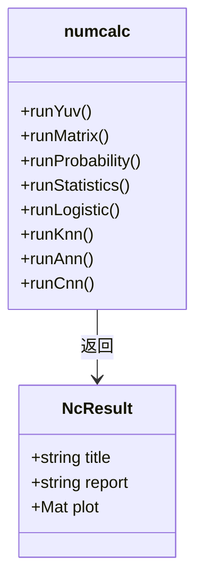
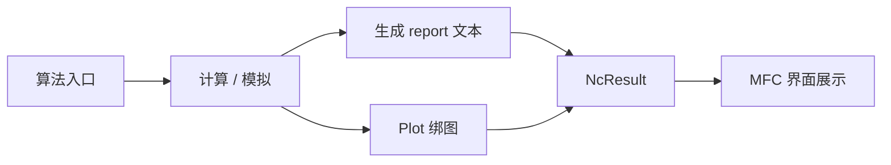
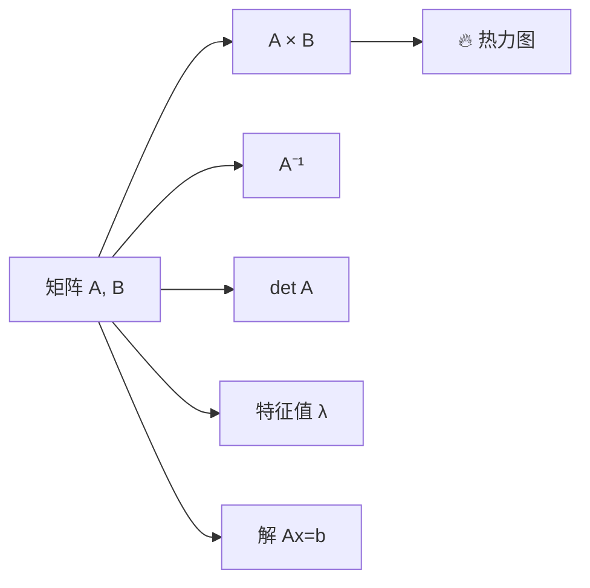
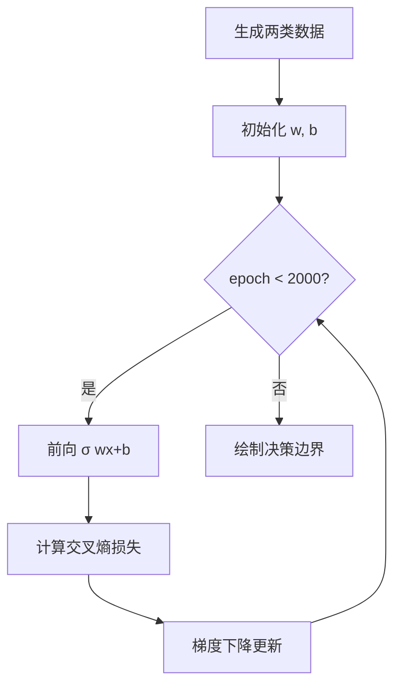
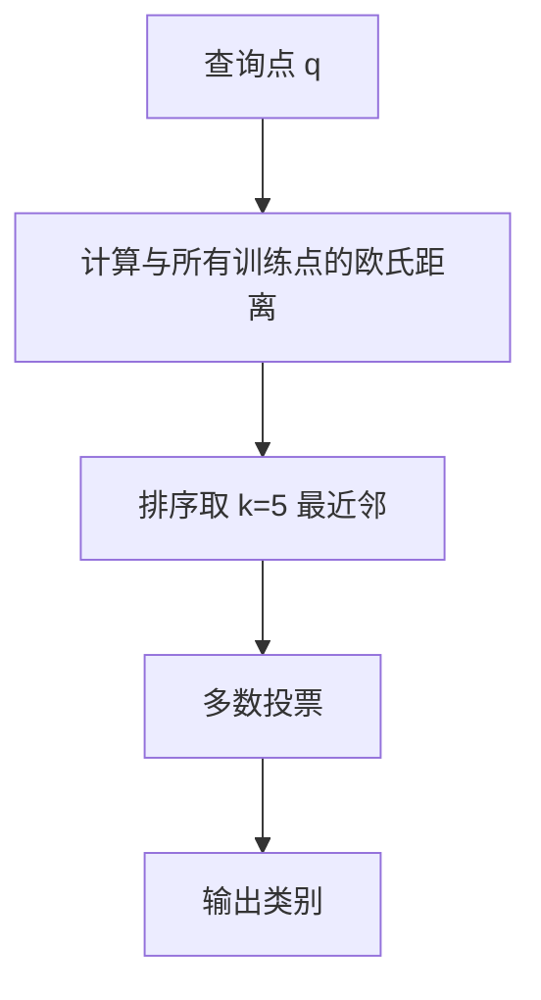
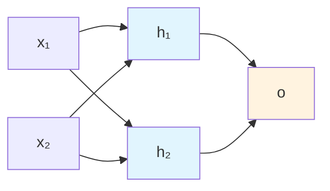
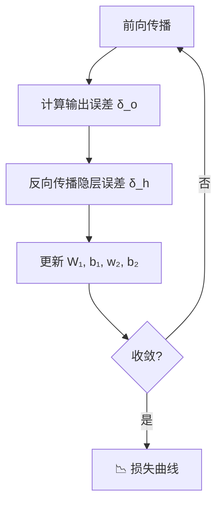
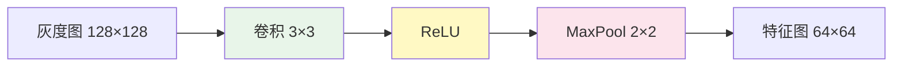
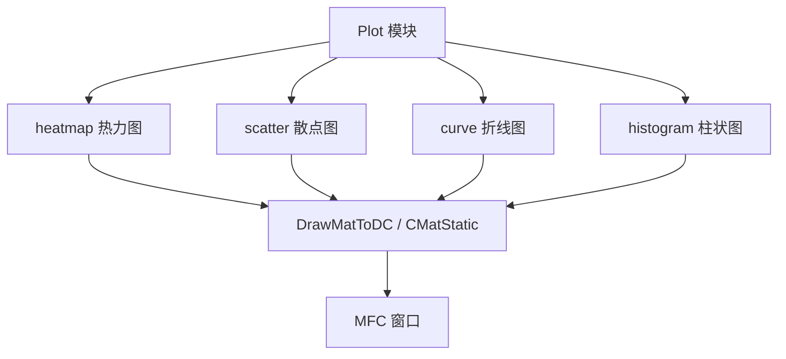

# 🧠 核心算法说明

本文档描述 `numcalc` 库中 8 种数值计算演示算法的数学原理与实现要点。各算法入口见 `code/src/numcalc/numcalc.h`，返回统一的 `NcResult{title, report, plot}` 结构。





---

## 0. 🎨 图像格式转换到 YUV

**文件**：`nc_yuv.cpp`  
**依赖**：OpenCV

### 📐 原理

- **YUV 颜色空间**：亮度分量 Y 与色度分量 U、V 分离，便于视频编码与传输。
- **BGR → YUV**：`cv::COLOR_BGR2YUV`，得到交错存储的 Y、U、V 三通道。
- **I420 (YUV420p)**：平面格式，Y 全分辨率，U/V 各为 1/4 分辨率（4:2:0 子采样），`cv::COLOR_BGR2YUV_I420`。

### 🔄 算例流程

```mermaid
flowchart TD
    A[📷 读取 people.jpeg] --> B[缩放 ≤480px 偶数尺寸]
    B --> C[BGR → YUV 分离]
    C --> D[计算 Y/U/V 均值]
    D --> E[💾 写入 converted_i420.yuv]
    D --> F[2×2 网格可视化]
    F --> G[BGR | Y | U | V]
```

1. 读取 `input/people.jpeg`（缺失则生成渐变测试图）
2. 缩放至长边 ≤ 480，并保证宽高为偶数
3. 分离 Y/U/V 通道，计算均值
4. 将 I420 原始字节写入 `../output/converted_i420.yuv`
5. 可视化：2×2 网格显示 BGR、Y、U、V

---

## 1. 🔢 矩阵运算

**文件**：`nc_matrix.cpp`  
**依赖**：Eigen 3

### 📊 算例矩阵
$$
A = \begin{bmatrix} 4 & 3 & 2 \\ 1 & 5 & 7 \\ 6 & 2 & 9 \end{bmatrix}, \quad
B = \begin{bmatrix} 1 & 0 & 2 \\ 0 & 3 & 1 \\ 4 & 1 & 0 \end{bmatrix}
$$

### ⚡ 运算

| 运算 | Eigen API | 说明 |
|------|-----------|------|
| 乘法 | `A * B` | 矩阵积 C |
| 转置 | `A.transpose()` | \(A^T\) |
| 行列式 | `A.determinant()` | \(\det(A)\) |
| 逆矩阵 | `A.inverse()` | \(A^{-1}\) |
| 线性方程组 | `A.colPivHouseholderQr().solve(b)` | 解 \(Ax=b\)，\(b=(6,4,9)^T\) |
| 特征值 | `EigenSolver<MatrixXd>` | \(\lambda_i\) |



可视化：对 \(C=A\times B\) 绘制热力图（`Plot::heatmap`）。

---

## 2. 🎲 概率

**文件**：`nc_probability.cpp`

### 📈 二项分布

\(X \sim B(n=10,\, p=0.4)\)：

$$
P(X=k) = \binom{n}{k} p^k (1-p)^{n-k}
$$
期望 \(E[X]=np\)，方差 \(\mathrm{Var}(X)=np(1-p)\)。

### 📉 标准正态分布

\(X \sim N(0,1)\)：

$$
\phi(x) = \frac{1}{\sqrt{2\pi}} e^{-x^2/2}, \quad
\Phi(x) = P(X \le x)
$$

### 🏥 贝叶斯定理示例

医学检测：先验 \(P(D)=0.01\)，灵敏度 0.99，特异度 0.95。

$$
P(D|+) = \frac{P(+|D)\,P(D)}{P(+|D)P(D) + P(+|\neg D)P(\neg D)}
$$

```mermaid
flowchart TD
    A[先验 P D=0.01] --> B{检测结果}
    B -->|阳性 +| C[贝叶斯更新]
    B -->|阴性 -| D[贝叶斯更新]
    C --> E[P D|+ ≈ 0.17]
    subgraph 分布可视化
        F[二项 PMF 柱状图]
        G[正态近似曲线]
    end
    F --> G
```

可视化：二项 PMF 柱状图 + 正态近似曲线叠加。

---

## 3. 📈 统计

**文件**：`nc_statistics.cpp`

### 📊 描述统计

对样本 \((x_i, y_i)\)，\(i=1..10\)：

- 均值：\(\bar{x}, \bar{y}\)
- 样本方差：\(s^2 = \frac{1}{n-1}\sum(x_i-\bar{x})^2\)
- 协方差：\(\mathrm{Cov}(x,y)\)
- Pearson 相关系数：\(r = \mathrm{Cov}(x,y)/(s_x s_y)\)

### 📏 最小二乘线性回归
$$
\hat{y} = a x + b, \quad
a = \frac{\mathrm{Cov}(x,y)}{\mathrm{Var}(x)}, \quad
b = \bar{y} - a\bar{x}
$$

```mermaid
xychart-beta
    title "线性回归示意"
    x-axis [1, 2, 3, 4, 5, 6, 7, 8, 9, 10]
    y-axis "y 值" 0 --> 20
    line [3, 5, 4, 8, 7, 10, 9, 12, 11, 14]
```

可视化：散点图 + 拟合直线。

---

## 4. 📉 逻辑斯回归（二分类）

**文件**：`nc_logistic.cpp`

### 🧮 模型
$$
P(y=1|x) = \sigma(w_0 x_1 + w_1 x_2 + b), \quad
\sigma(z) = \frac{1}{1+e^{-z}}
$$

### 🏋️ 训练

- 两类高斯团簇各 60 点
- 损失：交叉熵
- 优化：批量梯度下降，学习率 0.1，2000 epoch

决策边界：\(w_0 x_1 + w_1 x_2 + b = 0\)



可视化：按类别着色的散点 + 决策边界线。

---

## 5. 🎯 k 近邻（k-NN）

**文件**：`nc_knn.cpp`

### 🔍 算法



1. 计算查询点与所有训练点的欧氏距离
2. 取距离最小的 \(k=5\) 个邻居
3. 多数投票决定类别

### 📍 算例

3 类，每类 25 点，中心 \((2,2), (6,3), (4,6)\)，对 3 个查询点分类。

可视化：在网格上对每个像素做 k-NN 分类，绘制决策区域；星形标记为查询点。

---

## 6. 🧠 人工神经网络（ANN / MLP）

**文件**：`nc_ann.cpp`

### 🏗️ 网络结构



2 输入 → 2 隐层（Sigmoid）→ 1 输出（Sigmoid），学习 XOR 真值表。

### 🔁 反向传播

对样本 \((x, t)\)：



1. 前向：\(h = \sigma(W_1 x + b_1)\)，\(o = \sigma(w_2^T h + b_2)\)
2. 输出误差：\(\delta_o = (o-t)\,\sigma'(o)\)
3. 隐层误差：\(\delta_h = \delta_o w_2 \odot \sigma'(h)\)
4. 更新权重与偏置（学习率 0.5，20000 epoch）

可视化：训练损失曲线。

---

## 7. 🖼️ 卷积神经网络（CNN 前向片段）

**文件**：`nc_cnn.cpp`  
**依赖**：OpenCV

### ⚙️ 流水线



灰度图 128×128 → 卷积 3×3 → ReLU → 2×2 最大池化 → 64×64 特征图

### 🔲 卷积核（固定，非训练）

| 名称 | 核 | 说明 |
|------|-----|------|
| Sobel-X | 边缘检测 | 水平梯度 |
| Sobel-Y | 边缘检测 | 垂直梯度 |
| Laplacian | 二阶导数 | 边缘 |
| Blur | 3×3 均值 | 模糊 |

$$
\text{ReLU}(x) = \max(0, x), \quad
\text{MaxPool}_{2\times2}(x) = \max_{窗口} x
$$

可视化：2×2 网格显示四个滤波器的激活图（Viridis 伪彩色）。

---

## 📊 可视化模块

**文件**：`nc_plot.h` / `nc_plot.cpp`

基于 OpenCV 的轻量绑图：



- `curve`：折线图
- `scatter`：散点图（支持类别着色）
- `histogram`：柱状直方图
- `heatmap`：矩阵热力图

MFC 界面通过 `DrawMatToDC` / `CMatStatic` 将 `cv::Mat` 绘制到窗口。

---

## ©️ 版权

copyright@1999-2026 aesthetic company limited. All rights reserved.

联系方式：342247588@qq.com；微信号：kelvinluo79
