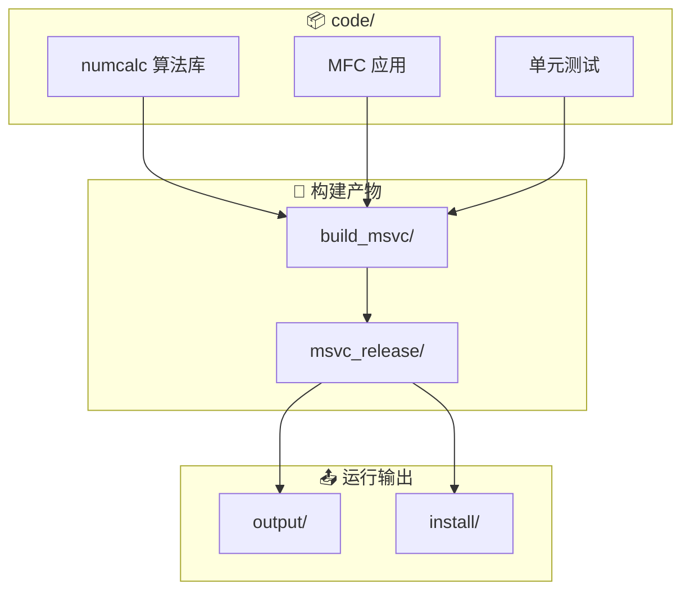
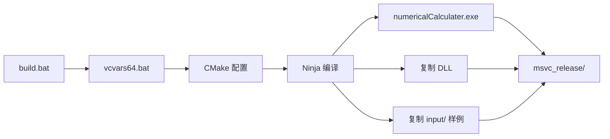
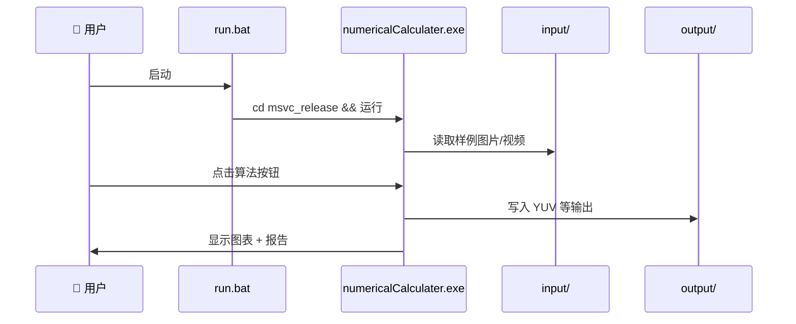
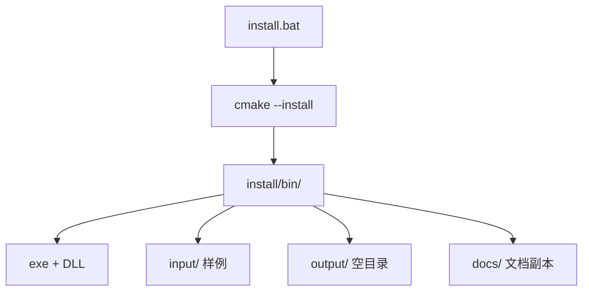
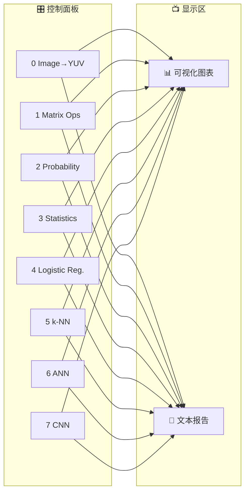

# 🔧 编译与运行说明

## 📂 项目结构

```
numericalCalculater/          # 项目根目录 (PROJECT_DIR)
├── code/                     # 源码与 CMake 工程 (CODE_DIR)
│   ├── CMakeLists.txt
│   ├── src/
│   │   ├── numcalc/          # 算法静态库（可单元测试）
│   │   └── app/              # MFC 图形界面
│   ├── tests/                # GoogleTest 单元测试
│   ├── scripts/              # 构建/运行/安装脚本
│   └── docs/                 # 文档
├── build_msvc/               # CMake 中间文件
├── msvc_release/             # 可执行文件与依赖 DLL
├── output/                   # 程序运行输出（如 YUV 文件）
└── install/                  # cmake --install 安装目录
```



所有路径在编译与运行时均使用**相对路径**，项目根目录可整体迁移。

## ⚙️ 环境要求

| 组件 | 路径（本机默认，可在 cmake 命令行覆盖） |
|------|------------------------------------------|
| 🔨 CMake 4.3+ | `D:\win10\cmake-4.3.2-windows-x86_64\bin\cmake.exe` |
| ⚡ Ninja | `D:\win10\ninja.exe` |
| 🏗️ Visual Studio 2022 | 含 MFC、x64 工具链 |
| 👁️ OpenCV 5.0 | `D:\win10\opencv500\build` |
| 📐 Eigen 3.3.7 | `D:\win10\deps_MD\eigen\eigen3.3.7_msvc2015_x64` |
| 📝 glog / gflags | 见 `code/cmake/Dependencies.cmake` |
| ✅ GoogleTest | 见 `code/cmake/Dependencies.cmake` |

## 🚀 一键编译

```bat
code\scripts\build.bat
```

可选 Debug 构建：

```bat
code\scripts\build.bat Debug
```



脚本会：

1. 调用 `vcvars64.bat` 初始化 MSVC 环境
2. 在 `build_msvc/` 中配置 Ninja + CMake
3. 将 `numericalCalculater.exe` 输出到 `msvc_release/`
4. 自动复制 OpenCV、glog 等依赖 DLL 到同目录
5. 若本机存在默认样例图片/视频，复制到 `msvc_release/input/`

## 🛠️ 手动编译

```bat
call "C:\Program Files\Microsoft Visual Studio\2022\Enterprise\VC\Auxiliary\Build\vcvars64.bat"

set PROJECT_DIR=d:\k8\kelvin_github\numericalCalculater
set CODE_DIR=%PROJECT_DIR%\code

D:\win10\cmake-4.3.2-windows-x86_64\bin\cmake.exe -S %CODE_DIR% -B %PROJECT_DIR%\build_msvc -G Ninja ^
  -DCMAKE_MAKE_PROGRAM=D:\win10\ninja.exe ^
  -DCMAKE_BUILD_TYPE=Release ^
  -DCMAKE_INSTALL_PREFIX=%PROJECT_DIR%\install

D:\win10\cmake-4.3.2-windows-x86_64\bin\cmake.exe --build %PROJECT_DIR%\build_msvc
```

## ▶️ 运行程序

```bat
code\scripts\run.bat
```

或：

```bat
cd msvc_release
numericalCalculater.exe
```



**⚠️ 注意**：请在 `msvc_release` 目录下启动，以便 `input/`、`../output/` 等相对路径正确解析。

### 📷 默认输入数据

| 类型 | 相对路径 | 原始路径（构建时复制） |
|------|----------|------------------------|
| 🖼️ 图片 | `input/people.jpeg` | `D:\k8\media_images\xi_an_hot\people.jpeg` |
| 🎬 视频 | `input/2026-06-15_154048_036.mp4` | `D:\k8\media_260612\2026-06-15_154048_036.mp4` |

界面中可通过 **Open Image...** 选择其他图片；YUV 转换与 CNN 算例会使用当前路径。

## 🧪 单元测试

```bat
cd msvc_release
numcalc_tests.exe
```

## 📦 安装

```bat
code\scripts\install.bat
```

等价于：

```bat
cmake --install build_msvc --prefix install
```



安装内容：

- `install/bin/numericalCalculater.exe`
- `install/bin/*.dll`（OpenCV、glog 等）
- `install/bin/input/`（样例数据）
- `install/output/`（空目录，供运行输出）
- `install/docs/`（文档副本）

## 🖥️ 界面操作

主窗口左侧为 8 种数值计算方法按钮，右侧上方为**可视化图表**，下方为**文本报告**。



| 按钮 | 功能 |
|------|------|
| 0 Image → YUV | BGR 转 YUV / I420，保存到 `../output/converted_i420.yuv` |
| 1 Matrix Ops | Eigen 矩阵乘、转置、行列式、逆、特征值、解方程 |
| 2 Probability | 二项分布、正态分布、贝叶斯示例 |
| 3 Statistics | 描述统计与最小二乘线性回归 |
| 4 Logistic Reg. | 梯度下降逻辑斯回归二分类 |
| 5 k-NN | k 近邻分类与决策区域图 |
| 6 ANN (MLP) | 两层感知机求解 XOR |
| 7 CNN | 卷积 + ReLU + 池化前向传播 |

**About...** 对话框显示 CMake 版本号、版权与联系方式。

## 🏷️ 版本号

版本在根 `code/CMakeLists.txt` 的 `project(... VERSION x.y.z)` 中定义，自动写入：

- 界面标题与 About 对话框
- Windows 资源 `version.rc`
- 头文件 `build_msvc/generated/nc_version.h`

当前版本：**1.0.0**
